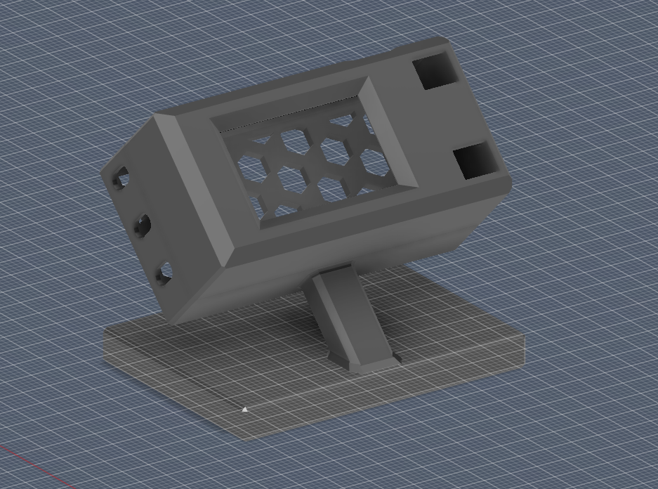
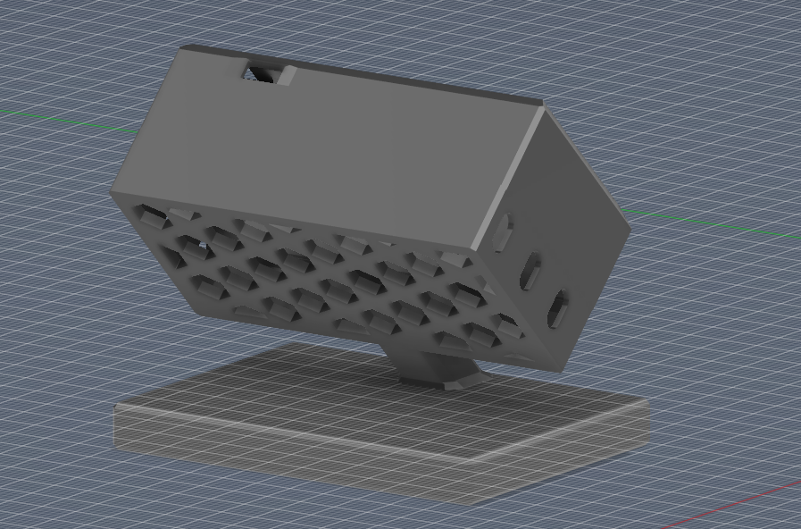

# 🌿 CO2 Sensor TTGO — Smart Air Quality Display

A real-time CO2 monitoring dashboard built on the **ESP32 TTGO T-Display**, integrating with **Home Assistant** via MQTT for a unified smart home display.

> **Note:** This project was developed using AI-assisted pair programming as a rapid-prototyping personal project. While functional and actively used, the codebase prioritizes working features over architectural perfection. Contributions and refinements are welcome.

---

## ✨ Features

| Feature | Description |
|---|---|
| 🫁 **CO2 Monitoring** | Real-time SCD30 readings with color-coded air quality bar |
| 🌡️ **Temperature & Humidity** | External sensor data from Home Assistant with EU comfort indicators |
| 🚪 **Door/Window Sensors** | Live status from HA contact sensors (configurable 0-2 doors, 0-3 windows) |
| 🪜 **Stair Motion** | Motion detection from HA binary sensors |
| 🔥 **Heating Status** | Shows active heating from climate entities |
| ⏰ **Clock Screen** | Full-screen clock with environmental summary |
| 🔔 **Alert System** | Lighthouse alarm (door), warnings (stairs, CO2, temp, hum), window timers |
| 🏠 **HA Auto-Discovery** | Registers as a single MQTT device in Home Assistant |
| ⚙️ **Remote Config** | Set sources, brightness, and screen from HA |

## 📸 Screens

The display has **3 screens**, switchable via hardware buttons or Home Assistant:

<video src="docs/demo.mp4" width="400" controls="controls"></video>

1. **Dashboard** — CO2 bar + temp/humidity + HA sensor grid
2. **Clock** — Large clock with date and environmental summary
3. **HA Detail** — Full-size HA sensor status with labels

## 🔔 Alerts (Day Hours Only)

| Trigger | Type | Behavior |
|---|---|---|
| Door opens | 🔴 ALARM | Lighthouse pulse for 10 seconds |
| Stair motion | 🟠 WARNING | While motion is detected |
| CO2 > 1500 ppm | 🟠 WARNING | "Open windows now!" |
| CO2 > 1000 ppm | 🔵 INFO | "Consider ventilating" |
| Temp/Hum out of range | 🟠 WARNING | Shows current value |
| Window open 5-30 min | 🔵 INFO | "Great ventilation!" ✓ |
| Window open > 30 min | 🔵 INFO | "Close window!" |

**Dismiss:** Left button = ignore for 24h · Right button = ignore for 7 days

---

## 🛠️ Hardware

| Component | Details |
|---|---|
| Board | LilyGO TTGO T-Display (ESP32 + 1.14" ST7789 TFT) |
| Sensor | Sensirion SCD30 (CO2, Temperature, Humidity) via I2C |
| Pins | Buttons GPIO 0/35 · I2C GPIO 21/22 · Backlight GPIO 4 |

### 🖨️ 3D Printable Case
We have included a custom-designed **45-Degree Desktop Stand** case for this exact hardware combination! It angles the display perfectly for your desk while ensuring massive airflow for the SCD30 to prevent heat soak from the ESP32.
* STL files and Printables upload text are available in the [`3d_print/`](3d_print/) folder.

 

## 📦 Setup

### 1. Prerequisites

- [PlatformIO](https://platformio.org/) (VS Code extension or CLI)
- Home Assistant with MQTT integration
- MQTT broker (e.g. Mosquitto)

### 2. Clone & Configure

```bash
git clone https://github.com/your-username/co2-sensor-ttgo.git
cd co2-sensor-ttgo

# Copy and edit the environment file
cp .env.example .env
# Edit .env with your WiFi and MQTT credentials
```

### 3. Customize Features

Edit `src/config.h` to match your setup:

```cpp
// Feature Toggles — set to 0 to disable
#define NUM_DOORS           1       // 0, 1, or 2
#define NUM_WINDOWS         2       // 0, 1, 2, or 3
#define ENABLE_STAIRS       1       // 0 = disabled
#define ENABLE_HEATING      1       // 0 = disabled
#define ENABLE_TEMP_HUM     1       // 0 = disabled (external temp/hum)
#define ENABLE_ALERTS       1       // 0 = disabled (alert overlay system)
```

Other configurable values:

| Config | Default | Description |
|---|---|---|
| `BRIGHTNESS_DAY` | 255 | Daytime brightness (0-255) |
| `BRIGHTNESS_NIGHT` | 30 | Night brightness |
| `NIGHT_START_HOUR` | 22 | Night mode start |
| `NIGHT_END_HOUR` | 7 | Night mode end |
| `CO2_GOOD` | 800 | Green threshold (ppm) |
| `CO2_MODERATE` | 1000 | Yellow threshold |
| `CO2_POOR` | 1500 | Red threshold |
| `WIN_GOOD_MS` | 300000 | Window "good" timer (5 min) |
| `WIN_CLOSE_MS` | 1800000 | Window "close" timer (30 min) |
| `DOOR_ALERT_MS` | 10000 | Door alarm duration (10 sec) |
| `GMT_OFFSET_SEC` | 3600 | Timezone offset (CET = 3600) |
| `TEMP_COMFORT_LOW/HIGH` | 19/23 | EU comfort temperature range (°C) |
| `HUM_COMFORT_LOW/HIGH` | 40/60 | EU comfort humidity range (%) |

### 4. Flash

```bash
pio run --target upload
```

### 5. Home Assistant Setup

See **[docs/home_assistant.md](docs/home_assistant.md)** for:
- Configuring source entities on the device page
- Setting up the bridge automation
- MQTT topic reference
- Troubleshooting

---

## 📁 Project Structure

```
├── .env.example          # Credential template
├── .gitignore
├── load_env.py           # Build script — reads .env into build flags
├── platformio.ini        # PlatformIO project config
├── docs/
│   └── home_assistant.md # HA integration guide + automation YAML
└── src/
    ├── config.h          # All configuration & feature toggles
    ├── display.h         # Display rendering, icons, alert overlays
    └── main.cpp          # WiFi, MQTT, sensor, alert logic
```

## 📄 License

This project is provided as-is for personal and educational use.
